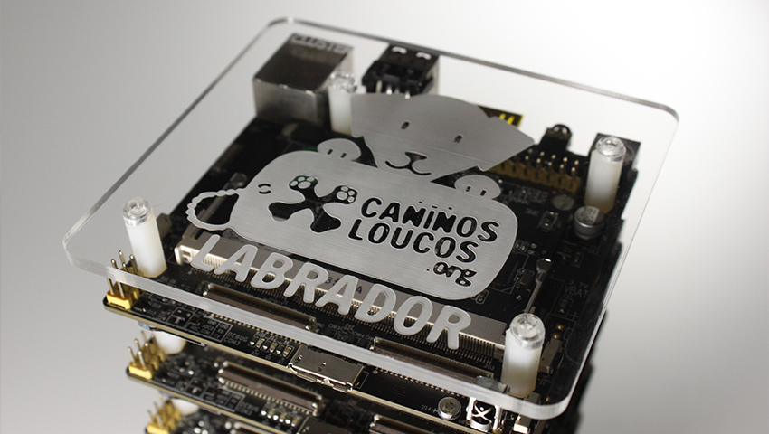
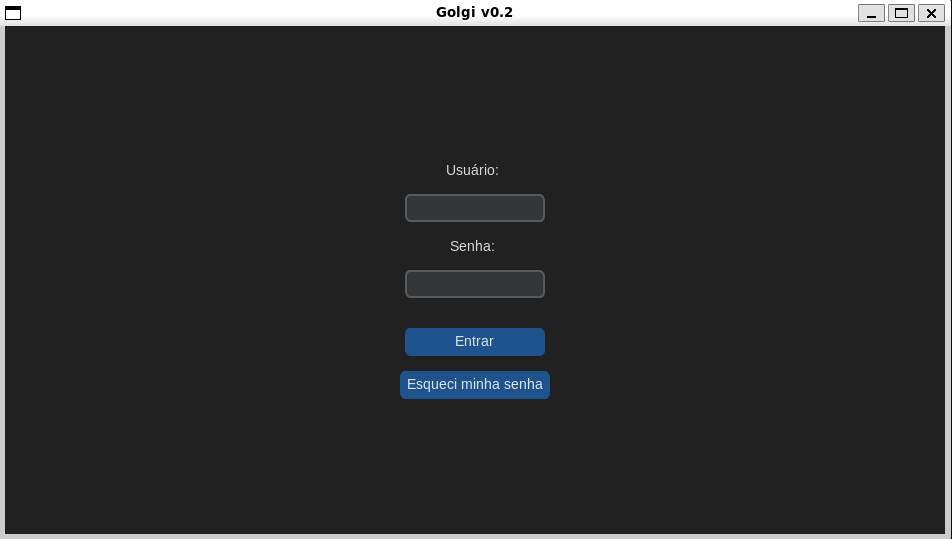
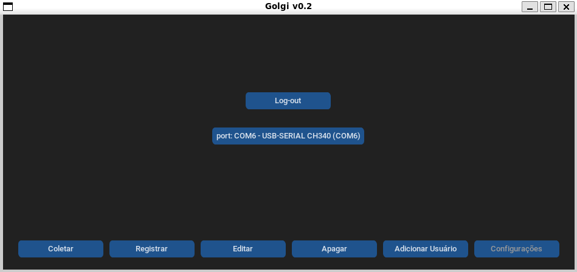
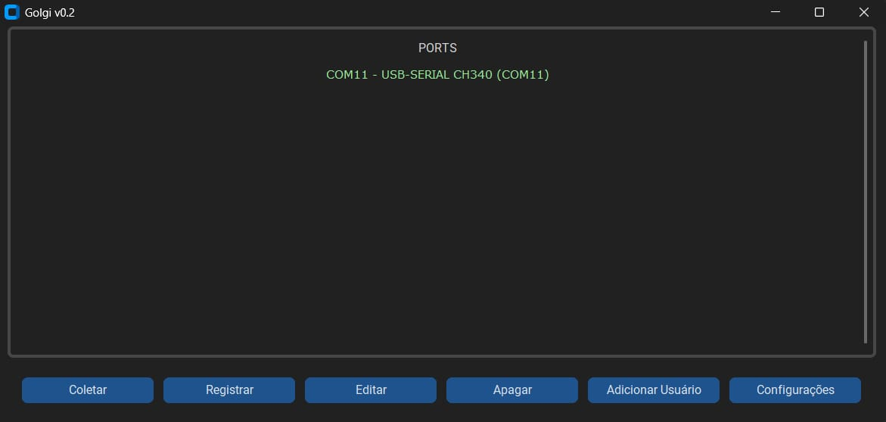
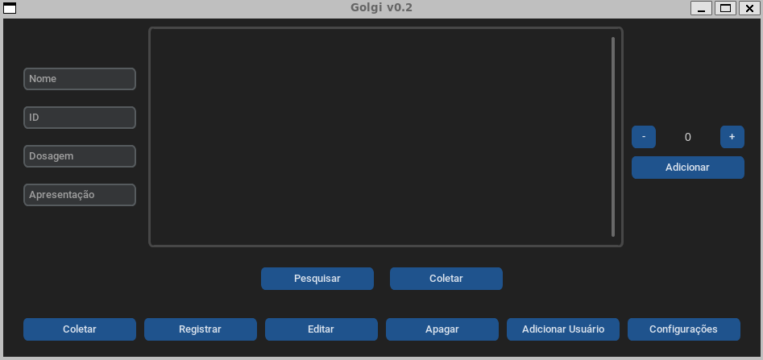
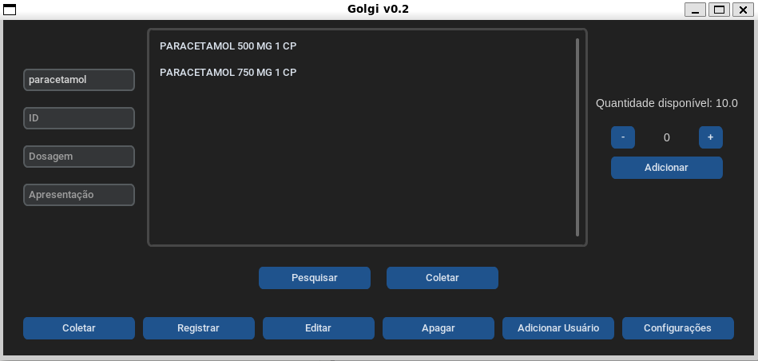

# Interface Gráfica do Golgi Bot

## Ambiente de Desenvolvimento

O projeto foi desenvolvido em uma **Labrador v2**, equipada com:

- **Processador:** ARM 32 bits  
- **Sistema Operacional:** Debian 12  
- **Python:** Versão 3.11.2

<div align="center">
  
</div>

### Saiba mais sobre a Labrador

A Labrador é uma placa desenvolvida pelo projeto **Caninos Loucos**, uma iniciativa brasileira focada em hardware aberto.  
Você pode saber mais sobre o projeto, especificações e outros modelos em:

**https://caninosloucos.org/pt/**

---

## Ambiente Virtual (venv)

Este projeto utiliza **venv** para gerenciar bibliotecas e isolar o ambiente.

### Criando e ativando o ambiente virtual

```bash
sudo apt install python3 python3-venv python3-pip

python3 -m venv venv
source venv/bin/activate
```

---

## Dependências

As bibliotecas necessárias (também presentes em `requirements.txt`) são:

```
customtkinter==5.2.2
darkdetect==0.8.0
numpy==2.1.1
packaging==24.1
pandas==2.2.3
pillow==10.4.0
pyserial==3.5
python-dateutil==2.9.0.post0
pytz==2024.2
six==1.16.0
tk==0.1.0
tzdata==2024.2
```

### Instalando dependências

Devido ao processador **ARM de 32 bits**, alguns pacotes (como `numpy`) não podem ser instalados via pip.

#### 1. Instalar a única dependência via pip:
```bash
source venv/bin/activate
pip install customtkinter
```

#### 2. Instalar demais dependências via APT:
```bash
sudo apt install python3-packagename
```

### Permitindo o uso de pacotes do sistema no venv

Edite o arquivo `venv/pyvenv.cfg`:

Antes:
```
include-system-site-packages = false
```

Depois:
```
include-system-site-packages = true
```

Isso permite que o ambiente virtual acesse os pacotes instalados via APT.

---

## Integração com o Sistema

Após configurar o ambiente virtual e instalar as dependências, é possível integrar a GUI ao sistema operacional e criar um atalho na área de trabalho.

Execute:

```bash
./install.sh
```

Para remover a integração:

```bash
./uninstall.sh
```

> Os scripts **não** criam o ambiente virtual nem instalam dependências — isso deve ser feito manualmente antes da instalação.

---

## Integração de Impressora Wireless

1. Configuração de Rede

Conecte a impressora à rede Wi-Fi principal (consultar manual da impressora).

Conecte a placa Labrador à mesma rede Wi-Fi.

Certifique-se se a impressora possui capacidade de utilizar 5G caso a Labrador esteja conectada a uma rede dessa frequência. Ambos os dispositivos necessitam estar na mesma geração de rede (preferencialmente 2.4GHz) para funcionar.

Descubra e anote o endereço IP local da impressora na rede (ex: 192.168.1.50, consultar manual da impressora).

2. Instalação de Dependências
A placa Labrador utiliza o CUPS (Common UNIX Printing System) para gerenciar a fila de impressão.

```bash
sudo apt-get update
sudo apt-get install cups hplip
```

3. Configuração via Protocolo IPP
Para contornar falhas de atributos no assistente nativo da HP (hp-setup) ou bloqueios de permissão na interface web, a impressora deve ser adicionada diretamente ao CUPS forçando o protocolo IPP (Internet Printing Protocol).

Execute o comando abaixo no terminal da Labrador, substituindo <IP_DA_IMPRESSORA> pelo endereço real obtido na etapa de rede:

```bash
sudo lpadmin -p ImpressoraRobo -E -v ipp://<IP_DA_IMPRESSORA>/ipp/print -m everywhere
```

4. Definição do Destino Padrão
Para evitar o erro lp: Error - No default destination ao executar chamadas simples de impressão diretamente do código, é fundamental avisar ao sistema operacional que esta será a impressora principal do sistema:

```bash
sudo lpadmin -d ImpressoraRobo
```

5. Validação e Teste
Para confirmar se a cadeia de impressão está funcionando, crie um arquivo de texto rápido no terminal simulando a saída de dados do robô:

```bash
echo "Relatorio de selecao de medicamentos gerado com sucesso." > relatorio_medicamentos.txt
```

Em seguida, envie o arquivo para a impressora utilizando o comando de impressão do Linux:

```bash
lp relatorio_medicamentos.txt
```

## Como Executar a Interface

No diretório do projeto:

```bash
source venv/bin/activate
python3 golgi_main.py
```

<div align="center">
  
</div>

Para testes, o login utilizado foi:

- **Usuário:** `0`  
- **Senha:** `admin`

---

## Configurando a Porta Serial

Na primeira execução, é necessário configurar a porta de comunicação com o Golgi Bot:

1. Vá até **Configurações**  
2. Clique no botão azul exibindo uma porta anterior  
3. Selecione a porta correta na lista exibida

<div align="center">
  
  
</div>

---

## Tela de Coleta

Após configurar a porta, acesse a tela de **Coleta**:

1. (Opcional) Informe os dados do paciente  
2. Pesquise o medicamento  
3. Clique sobre o nome para selecioná-lo  
4. Escolha a quantidade  
5. Adicione ao carrinho  
6. Clique em **Coletar** para que o Golgi execute a operação

<div align="center">
  
  
</div>
